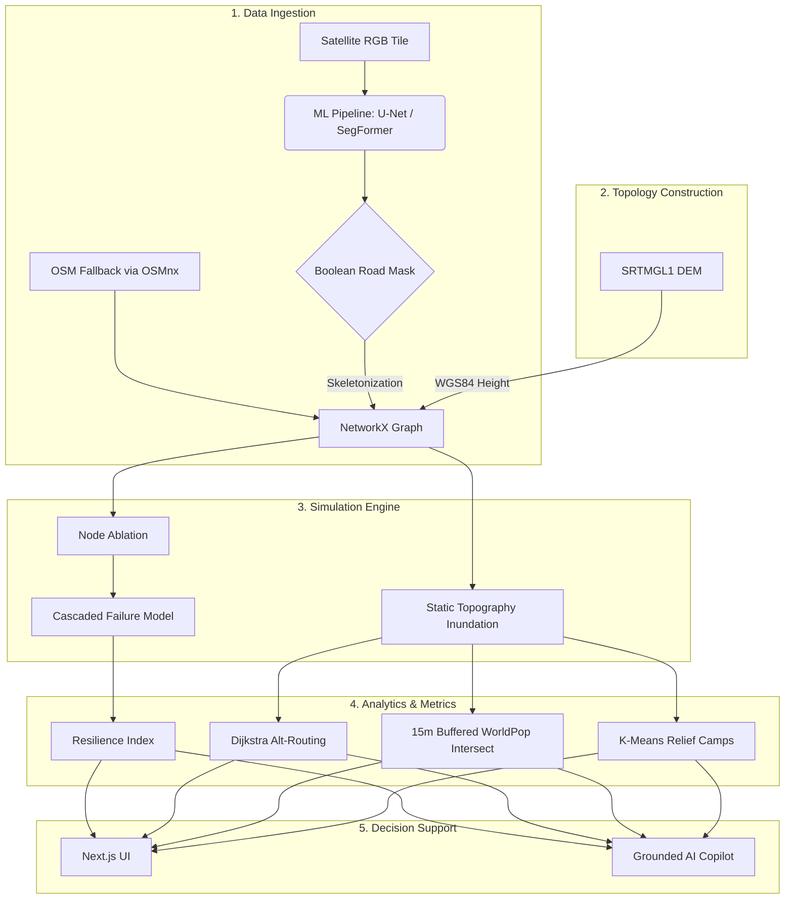

# Route Resilience

**Occlusion-Robust Road Extraction & Graph-Theoretic Criticality Analysis for Urban Mobility**

Route Resilience is a decision-support backend and dashboard built to analyze urban network vulnerability during extreme weather events. Moving beyond static flood mapping, it applies deterministic topological models to quantify the structural impact of disasters on urban mobility.

Built for ISRO NNRMS — Problem Statement PS4

---

## 1. Project Overview & Motivation

During severe urban flooding, emergency responders often lack real-time topological intelligence. While existing systems identify flooded areas, they fail to answer network-level questions: *If this junction floods, how does the load redistribute? Which hospitals become inaccessible? Where should relief camps be positioned for the surviving population?*

Route Resilience combines Computer Vision (for road extraction), Graph Theory (for topological routing and centrality analysis), and Geospatial Data (DEM, WorldPop) into a unified simulation engine to address these critical operational gaps.

---

## 2. Architecture & Data Flow



---

## 3. Data Integrity & Terminology

To prevent scientific overreach, this project strictly adheres to the following vocabulary:
*   **OBSERVED:** Empirical data from external authorities (e.g., IMD 131mm rainfall, OWM current rain rate).
*   **DERIVED:** Mathematically computed values strictly from observed inputs (e.g., rainfall $\times$ runoff coefficient).
*   **SIMULATED:** Algorithmic outputs based on topological and geometric models (e.g., static DEM flood extents, node ablation).
*   **CALIBRATED:** Manual parameter overrides used when standard mathematical models break down under extreme outlier conditions.
*   **EXTRAPOLATED:** Future projections based on linear persistence of present conditions, explicitly avoiding meteorological forecasting.

---

## 4. Scenario Deep Dives

### P1: Historical Disaster Scenario (2022 Bengaluru Flood)
Models the severe September 5, 2022, flooding in Bengaluru.
*   **Observed Facts:** 131mm peak 24-hour rainfall (IMD). News archives documented flooding in areas like Koramangala.
*   **Rainfall-Derived Output:** Standard uniform-runoff models fail for extreme localized urban events. The formula derives a water level of 877.09m, which predicts only **5** flooded nodes on the 13,000+ node graph.
*   **Calibrated Scenario Input:** To match historical reality, the scenario water level is explicitly **calibrated** to 905m elevation contour to geographically encompass the documented flood extent. It is *not* a predictive meteorological output from the 131mm rainfall.
*   **Simulated Impacts:** The calibrated 905m flood extent triggers the network simulation, revealing isolated hospitals and disconnected communities.

### P2: Temporal Scenario Projection
Projects flood risk across time horizons (NOW, +30min, +60min, +90min).
*   **NOW State (Observed):** Current 1-hour rainfall accumulation (mm) fetched via OpenWeatherMap.
*   **+30/+60/+90 (Extrapolated):** Computed by assuming the current rainfall rate persists linearly. **This is a linear persistence assumption, not a meteorological forecast.**
*   **Network Consequences (Simulated):** Water levels at each extrapolated horizon are mapped against the static DEM bathtub model to simulate progressive topological collapse.

---

## 5. Algorithms & Methodology

### Graph Construction & Routing
*   **Edge Weights (`time_s`):** Shortest-path routing operates on travel time. For ML-extracted road masks, skeletonized edges default to a static `30 km/h` speed since semantic models cannot determine road hierarchy. Conversely, the **OSM fallback graph** utilizes explicit road-class speed limits (e.g., `motorway` = 80km/h).
*   **Routing Penalties:** Alternative routes are discovered via Dijkstra's algorithm, explicitly penalizing edges on the primary path with a `4.0x` multiplier to enforce topologically distinct alternatives.

### Topography (DEM)
*   **Static Inundation:** Flood extent is determined via a static height-threshold (bathtub model) using 30m SRTMGL1 data. This is a purely geometric approximation and is **never** characterized as a hydrodynamic or fluid simulation.

### Population (WorldPop)
*   **Spatial Intersection:** WorldPop 2020 (100m gridded estimates) is queried via spatial raster intersection. Flooded edge `LineStrings` are unioned and buffered by **15m**. `rasterio.mask` intersects the 100m raster pixels overlapping this road-corridor boundary. 
*   **Integrity Constraint:** Assigning broad raster population data to 1D graph nodes mathematically is explicitly avoided. Consequently, population impacts are calculated purely for spatial flood extents, *not* for abstract node-ablation scenarios. WorldPop is an order-of-magnitude estimate, never treated as census ground truth.

### Cascading Failure & Resilience
*   **Cascading Failure:** Models secondary chokepoint collapse. After initial node ablation, Betweenness Centrality is recomputed. Nodes exceeding a dynamically increasing stress threshold (`dampening factor = 0.15` per iteration) fail in successive waves, ensuring mathematical decay.
*   **Resilience Index (RI):** $RI = \frac{\text{Baseline Avg Travel Time}}{\text{Perturbed Avg Travel Time}}$. Disconnected paths are severely penalized with an assumed 3600-second (1 hour) delay.

### Decision Support
*   **Relief Camp Optimization:** Uses deterministic K-Means clustering (`random_state=42`) on the spatial coordinates of the surviving graph's Largest Connected Component (LCC) to select $k$ optimal safe-zone locations.
*   **AI Copilot (`qwen/qwen3.6-27b`):** Grounded via a deterministic JSON snapshot of the active `GraphStore` (flood levels, resilience metrics). Incorporates a strict HTTP 429 rate-limit fallback to ensure the primary dashboard never crashes during LLM outages.

---

## 6. Data Sources

| Domain | Source | Resolution / Notes |
|---|---|---|
| **Topography** | SRTMGL1 (`.hgt`) | 1-arcsecond (~30m) WGS84 |
| **Population** | WorldPop 2020 UN-adj (`.tif`) | ~100m gridded estimates |
| **Meteorology** | OpenWeatherMap / IMD (2023) | API / Gridded historical records |
| **Infrastructure** | Sentinel-2 / OSM Overpass | RGB Tiles / Point-of-Interest coordinates |

---

## 7. API Reference

| Endpoint | Method | Description |
|----------|--------|-------------|
| `/segment/` | POST | Segments an RGB tile into a road mask. |
| `/graph/build` | POST | Converts skeletonized masks into a NetworkX graph. |
| `/simulate/ablate` | POST | Ablates specific nodes; returns the Resilience Index. |
| `/simulate/cascade` | POST | Executes the dampened iterative cascading failure model. |
| `/simulate/flood` | POST | Simulates inundation via static DEM elevation thresholds. |
| `/simulate/route` | POST | Dijkstra shortest path with penalized alternative routing. |
| `/simulate/relief-camps` | POST | Finds optimal safe-zone coordinates using K-Means clustering. |
| `/simulate/rainfall-backtest`| POST| Evaluates historical 2023 IMD events for directional validation. |
| `/copilot/chat` | POST | Queries the context-grounded `qwen3.6-27b` Copilot. |

*(Swagger UI is available at `http://localhost:8000/docs`)*

---

## 8. Project Structure

```text
route-resilience/
├── backend/
│   ├── app/
│   │   ├── api/          # FastAPI routers
│   │   ├── ml/           # U-Net/SegFormer models & PyTorch inference
│   │   ├── graph_pipeline/# Skeletonization & centrality metrics
│   │   ├── simulation/   # Disaster physics, routing, camps, resilience
│   │   └── data/         # WorldPop raster handling & IMD parsers
│   ├── tests/            # Pytest automated suite
│   └── requirements.txt
├── frontend/             # Next.js 14 / Tailwind / Leaflet UI
├── DataSet/              # Required local datasets (.hgt, .tif, .csv)
└── docker-compose.yml
```

---

## 9. Setup, Run & Test

1. **Clone & Environment:**
   ```bash
   git clone https://github.com/your-team/route-resilience.git
   cd route-resilience
   cp backend/.env.example backend/.env
   # Edit backend/.env and set GROQ_API_KEY
   ```

2. **Backend Setup:**
   ```bash
   cd backend
   python -m venv .venv
   source .venv/bin/activate  # Windows: .venv\Scripts\activate
   pip install -r requirements.txt
   uvicorn app.main:app --reload --host 0.0.0.0 --port 8000
   ```

3. **Frontend Setup:**
   ```bash
   cd ../frontend
   npm install
   npm run dev
   ```
   *(Access dashboard at `http://localhost:3000`)*

4. **Testing:**
   ```bash
   cd backend
   .venv\Scripts\python -m pytest tests/
   ```

> [!SUCCESS]
> **Testing Status:** The core pytest suite is actively maintained and currently returns 0 failures, thoroughly covering deterministic impacts, temporal projections, and adversarial bounds.

---

## 10. Validation, Performance & Limitations

### Validation / Integrity
*   **Directional Validation:** The `/simulate/rainfall-backtest` endpoint computes static DEM flood extents for empirical 2023 IMD daily records and aligns them against documented BBMP flood reports for *directional validation*. It strictly avoids claiming ground-truth hydrodynamic accuracy.
*   **Determinism:** Given the same `.hgt` topography, `.tif` population data, and OSM graph, all routing, clipping, and cascading algorithms are mathematically deterministic.

### Performance
*   **Pre-computation:** To maintain low latency, initial topological metrics (Betweenness Centrality for $k=50$, Articulation Points) are computed on background threads during startup, ensuring base endpoints respond in `< 3.0 seconds`.
*   **Cascading Scale:** Complex iterative cascading simulations scale linearly in computation time based on the number of iterations and the $k$ sample size of the centrality recomputations.

### Limitations
1.  **Static Bathtub Flooding:** Relies strictly on geometric elevation thresholds. It does not account for hydrodynamic flow, water velocity, or drainage infrastructure.
2.  **Centrality-based Cascades:** Redistributes load based purely on betweenness centrality logic, not microscopic vehicle traffic or localized congestion limits.
3.  **ML Speed Assumptions:** ML-extracted roads assume a flat 30km/h speed limit due to the inability to semantically classify road hierarchies from binary masks.

### Future Work
*   Integrate full 1D/2D hydrodynamic routing (e.g., EPA SWMM) to replace the static DEM approximation.
*   Leverage premium sub-hourly weather APIs (e.g., OWM OneCall 3.0) for genuine meteorological nowcasting.
*   Train semantic segmentation models to extract distinct road classes, allowing for variable speed modeling on ML-derived graphs.
